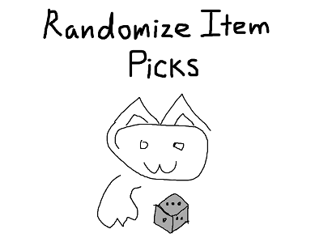
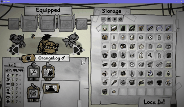

## Randomize Item Picks

I spend too much time drafting equipment for my cats.

To break this analysis paralysis, this mod picks random items for a cat at the press of the "R" key.

## Use

In the equipment drafting menu after picking cat collars, press "R" to randomize equipment selection for a given cat.

The randomizer is currently very simple, and will try to fill each of the cat's equipment slots with any non-cursed, non-quest item.

## Installation requirements

This mod is packaged for the [Mewtator](https://www.nexusmods.com/mewgenics/mods/1) mod loader and [Mewjector](https://www.nexusmods.com/mewgenics/mods/218) dll loader.

Both are highly recommended for a standard install.

If you encounter crashes or cannot trigger item shuffling, please verify:
* the version of Mewgenics you have installed matches the required version specified in this mod's release notes.
* you have the latest versions of [Mewtator](https://www.nexusmods.com/mewgenics/mods/1) and [Mewjector](https://www.nexusmods.com/mewgenics/mods/218) installed.
* you have dll mod support enabled in Mewtator.

Note that since the Mewgenics dll modding scene is still in its infancy, and because the developers have active plans to release fixes and new content, this mod will likely break in the future with each game update.

## Build requirements

This repository is self-contained, apart from tooling (all C/C++ source code, including that of dependencies, is included).

To compile the dll from source, [CMake](https://cmake.org/) and a contemporary version of the [MSVC compiler (2022/2026)](https://visualstudio.microsoft.com/downloads/) are required.

To execute `cpp/randomize_item_picks/misc/find_rvas.py`, [Python 3.x](https://www.python.org/downloads/) is required.

Developers may appreciate that this dll can be injected standalone with the tool provided under `cpp/cosmic_ooze`, or another tool such as Cheat Engine or System Informer. Players should use Mewjector.

## Licensing

All original material outside of `third_party` directories are distributed under the MIT license. See [LICENSE.md](LICENSE.md) for details.

See [ATTRIBUTION.md](ATTRIBUTION.md) and license documents under `third_party` directories for dependency licenses.
